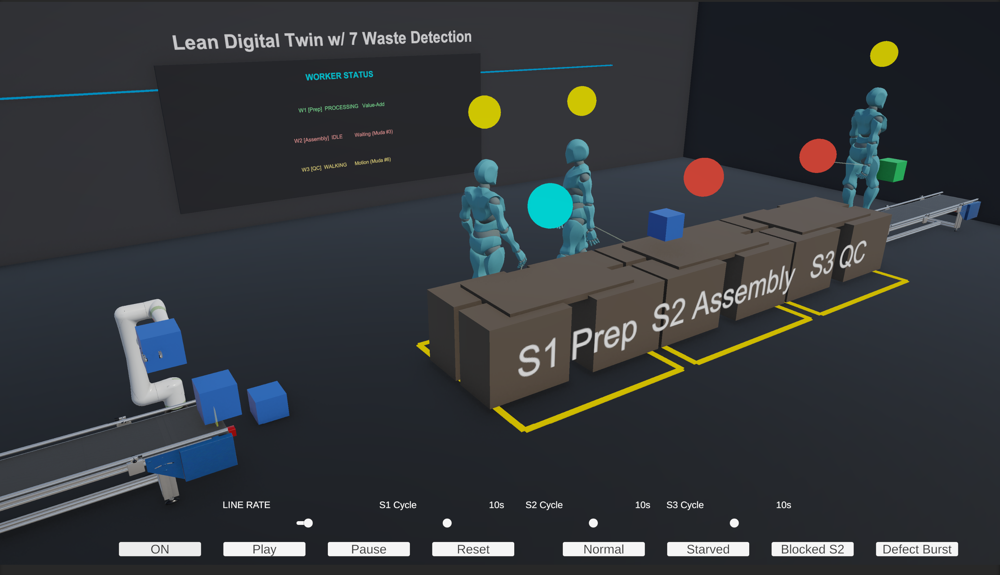
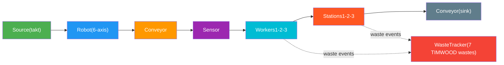

# LeanTwin

### A 3D Digital Twin for Learning Lean Manufacturing

LeanTwin is an interactive simulation of a production cell built in Unity. Drop parts onto a conveyor, watch workers move between stations, and see **waste light up in real time** as takt times slip, inventory piles up, or defects roll off the line. Tune parameters with sliders, load preset scenarios, and build intuition for the seven wastes of lean manufacturing -- all without stopping a real factory.

---

> **Quick start:** Open the project in Unity 6000.4.0f1, load `Assets/LeanCell/Scenes/LeanCell.unity`, and press Play.

---

<!-- Replace the path below with an actual screenshot of the running simulation -->



**Youtube Video**
<!-- Replace the URL below with your YouTube video link -->
[](https://youtu.be/j8qosLLqBK4)

---

## What You Can Do

| | Feature | Description |
|---|---|---|
| :factory: | **Run a production cell** | A 6-axis robot feeds a conveyor that carries parts through three workstations staffed by NavMesh-driven workers |
| :bar_chart: | **Track KPIs live** | Throughput, WIP, defect rate, cycle times, and bottleneck detection update on a heads-up dashboard |
| :rotating_light: | **See waste as it happens** | A color-coded overlay scores all seven TIMWOOD wastes -- Transport, Inventory, Motion, Waiting, Overproduction, Over-processing, Defects |
| :control_knobs: | **Tune every parameter** | Takt time, defect rate, per-station cycle times -- adjust with sliders and watch the cell respond |
| :stopwatch: | **Control time** | Play, pause, reset. A simulation clock tracks elapsed time and takt beats |

---

## Architecture at a Glance



The simulation is **event-driven**. A central event bus (`LeanCellEvents`) decouples all systems -- MU lifecycle, station processing, worker movement, waste detection, and UI -- so each component subscribes only to what it needs.

**Invoke-based polling** (`InvokeRepeating`) is used instead of `Update()` for compatibility with the realvirtual industrial-simulation framework.

---

## Project Structure

```
LeanTwin/Assets/LeanCell/
  Scenes/         LeanCell.unity          -- main simulation scene
  Scripts/
    Core/         LeanCellManager          -- central orchestrator & parameters
                  CellOrchestrator         -- MU flow state machine (7 states)
                  LeanCellEvents           -- event bus
                  SimulationClock          -- time & takt tracking
    Devices/      RobotController          -- 6-axis Fanuc with pick/place poses
                  WorkStation              -- processing, progress bar, safety lines
                  WorkerController         -- NavMesh pathfinding & state machine
                  SourceTaktController     -- takt-driven MU generation
    Waste/        WasteTracker             -- TIMWOOD detection & scoring
                  WasteEvent               -- event data (type, severity, color)
                  WasteVisualizer          -- post-processing overlay
    UI/           DashboardController      -- KPI rail
                  ControlPanel             -- sliders & buttons
                  KeyboardShortcuts
    Config/       ScenarioPreset           -- ScriptableObject presets
  Data/           4 preset assets (ScriptableObjects)
```

---

## Dependencies

| Dependency | Version | Purpose |
|---|---|---|
| **Unity** | 6000.4.0f1 | Engine |
| **Universal Render Pipeline** | 17.4.0 | Rendering & post-processing (waste overlay) |
| **AI Navigation** | 2.0.11 | NavMesh for worker pathfinding |
| **Input System** | 1.19.0 | Keyboard shortcuts & controls |
| **Timeline** | 1.8.11 | Animation sequencing |
| **Recorder** | 5.1.5 | Capturing simulation footage |
| **Visual Scripting** | 1.9.10 | Visual scripting support |
| **TextMesh Pro** | (bundled) | UI text rendering |
| **realvirtual** | (Assets) | Industrial automation framework -- Source, Sink, MU, Drive, Sensor, Fixer, signal management |
| **NaughtyAttributes** | (Assets) | Inspector enhancements |
| **IngameDebugConsole** | (Assets) | Runtime debug overlay |
| **MCP for Unity** | (Packages) | Model Context Protocol integration |

---

## Getting Started

1. **Clone the repo**
   ```bash
   git clone https://github.com/YOUR_ORG/LeanDigitalTwin.git
   ```
2. **Open in Unity Hub** -- select Unity **6000.4.0f1** or later
3. **Open the scene** -- `Assets/LeanCell/Scenes/LeanCell.unity`
4. **Press Play**
5. **Experiment** -- use the control panel to swap presets, drag sliders, and toggle the waste overlay

---

## License

This project is licensed under the [MIT License](LICENSE).
